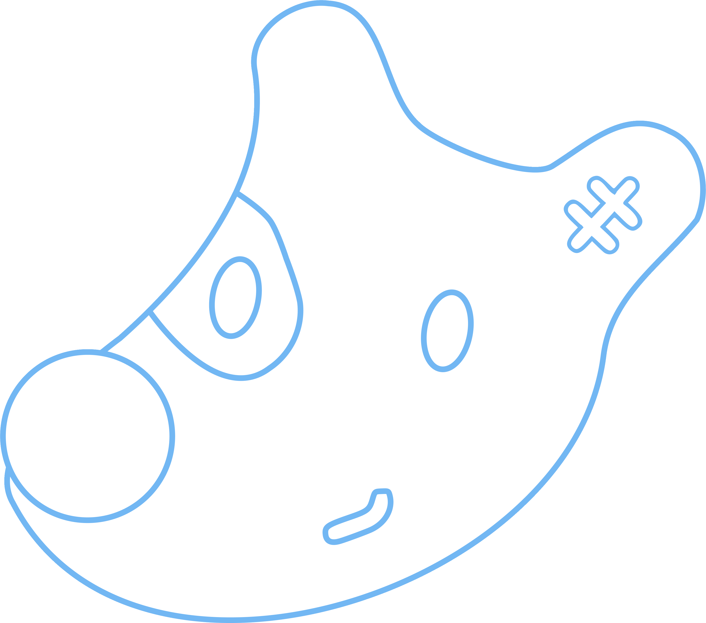
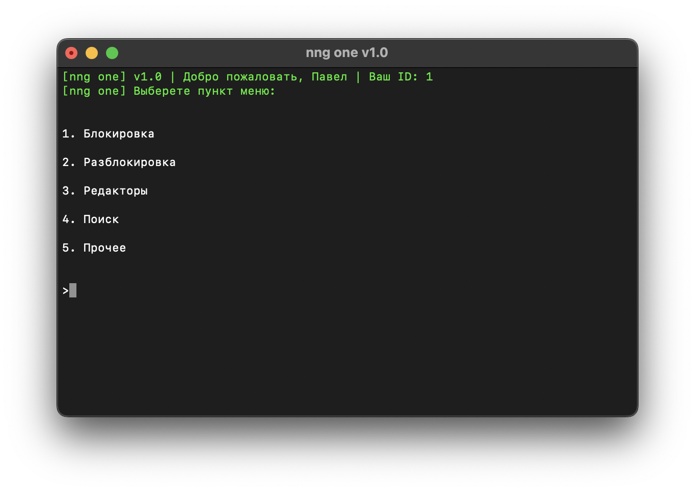

<p align="center">
  <p align="center">
    
  </p>
  <p align="center">nng one</p>
</p>

[](LICENSE)
[](https://github.com/MrAlonas/nng-one/issues)
[](https://github.com/MrAlonas/nng-one/actions/workflows/build.yml)

# 🤔 Что это такое?

Это скрипт, позволяющий автоматизировать массовые действия для групп nng.

<p align="center">
  
</p>

# ✨ Возможности скрипта

1. Выполнение массовых действий
    1. Блокировка пользователей
    2. Разблокировка пользователя или пользователей
    3. Выдача редактора пользователю или пользователям
    4. Снятие редактора пользователю или пользователям
    5. Удаление всех записей со стены в сообществе или сообществах
    6. Репост записи в сообщества
    7. Создание историй в сообществах
    8. Снятие заблокированных страниц из редакторов
    9. Автоматическое создание новой группы
    10. Снятие редактора у неактивных страниц
2. Возможность поиска
    1. Определённого редактора в сообществе или сообществах
    2. Несостыковок в чёрном списке сообщества и общем списке
3. Вывод статистики по сообществам (с учётом и без учёта заблокированных страниц)
    1. Всего групп
    2. Всего слотов под редакторов
    3. Общее количество подписчиков
    4. Общее количество редакторов
    5. Общее количество подписчиков и редакторов без учёта заблокированных и дубликатов
    6. Максимальное количество руководителей
4. Выполнение действий без капчи
    1. Посредством задержек
    2. Через ruCaptcha
5. Отключение [Callback API Бот](https://vk.com/cbbot) при массовых действиях

# 📀 Установка

Скачайте [последний релиз](https://github.com/MrAlonas/nng-one/releases/latest).

# ⚙️ Настройка

## config.json

```json
{
  "Token": "Токен страницы, от которой выполняются действия",
  "RuCaptchaToken": "Токен ruCaptcha",
  "BanReason": "Комментарий при блокировке пользователя",
  "BnndUrl": "Ссылка на список заблокированных из API",
  "GroupsUrl": "Ссылка на список групп из API",
  "CaptchaBypass": false, // Обход капчи при массовых действиях БЕЗ использования ruCaptacha
  "SwitchCallback": true, // Отключение Callback API Бот при массовых действиях
  "Sentry": true // Согласие на отправку отчётов об ошибках
}
```

# 🙏 Спасибо

[](https://www.macstadium.com)
